<div align="center">

<h1 style="font-size: 3rem; margin-bottom: 0.25rem;">
  Homotopy-Conditioned MPPI
</h1>

<h2 style="font-size: 1.5rem; font-weight: 400; margin-top: 0;">
  Bridging Geometric Planning and Dynamics-Aware Control
</h2>

<br>

<h3>
  <a href="#overview">Overview</a>
  &nbsp;·&nbsp;
  <a href="#animations">Animations</a>
  &nbsp;·&nbsp;
  <a href="#methods">Methods</a>
  &nbsp;·&nbsp;
  <a href="#experiments">Experiments</a>
  &nbsp;·&nbsp;
  <a href="#usage">Usage</a>
</h3>

</div>

<p align="center">
  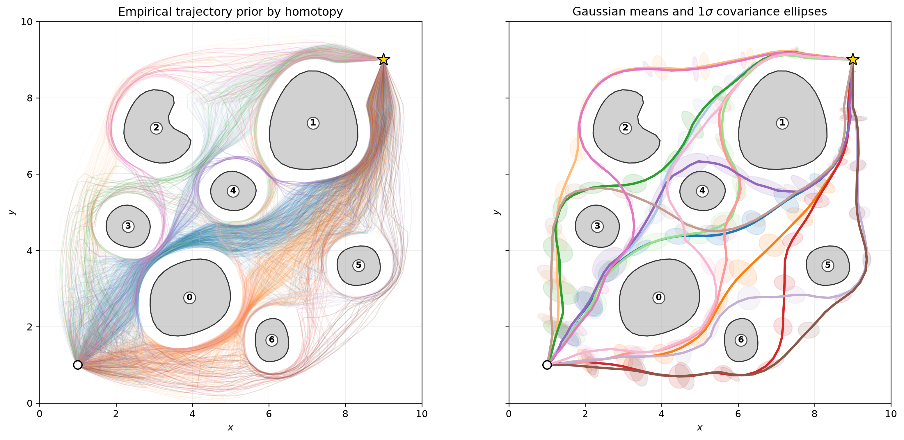
</p>

<p align="center">
  <em>Priors used to inititialize the MPPI controller: on the left, the empirical trajectories, on the right the extracted gaussian representation.</em>
</p>

<p align="center">
  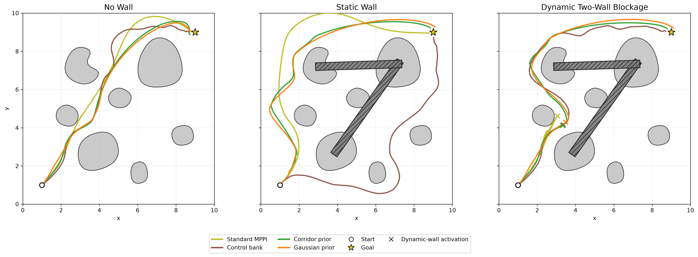
</p>

<p align="center">
  <em>Controller trajectories across the no-wall, static-blockage, and dynamic two-wall experimental conditions with every MPPI variant (priors).</em>
</p>

---

## Overview

Model Predictive Path Integral (MPPI) control is a sampling-based, receding-horizon method for nonlinear systems. Its performance depends heavily on the proposal distribution: proposals that are too narrow can miss feasible routes, while overly broad proposals waste a limited rollout budget.

This project improves MPPI by conditioning its proposals on geometric trajectories grouped by homotopy class. A topology-aware fish-school planner discovers collision-free routes around obstacles, and the resulting trajectory priors guide MPPI toward distinct topological alternatives.

The geometric prior changes **where MPPI samples**. It does not replace the system model or modify the shared rollout objective. Dynamic feasibility is still evaluated through the predictive dynamics at every control step.

### Key ideas

<table>
  <tr>
    <td width="50%" valign="top">
      <strong>1. Discover diverse routes</strong><br>
      Generate collision-free paths using a topology-aware stochastic planner.
    </td>
    <td width="50%" valign="top">
      <strong>2. Separate homotopy classes</strong><br>
      Group trajectories by homotopy signature.
    </td>
  </tr>
  <tr>
    <td width="50%" valign="top">
      <strong>3. Build trajectory priors</strong><br>
      Represent each route class with empirical paths, mean trajectories, and covariance information.
    </td>
    <td width="50%" valign="top">
      <strong>4. Convert geometry into controls</strong><br>
      Localize each path and convert it into model-specific nominal controls.
    </td>
  </tr>
  <tr>
    <td width="50%" valign="top">
      <strong>5. Condition MPPI sampling</strong><br>
      Allocate rollouts around multiple route-conditioned proposals.
    </td>
    <td width="50%" valign="top">
      <strong>6. Preserve fair comparisons</strong><br>
      Evaluate every controller with the same dynamics and objective.
    </td>
  </tr>
</table>

### Ackermann vehicle

#### No wall

| Standard MPPI | SPG-prior MPPI |
|:---:|:---:|
| 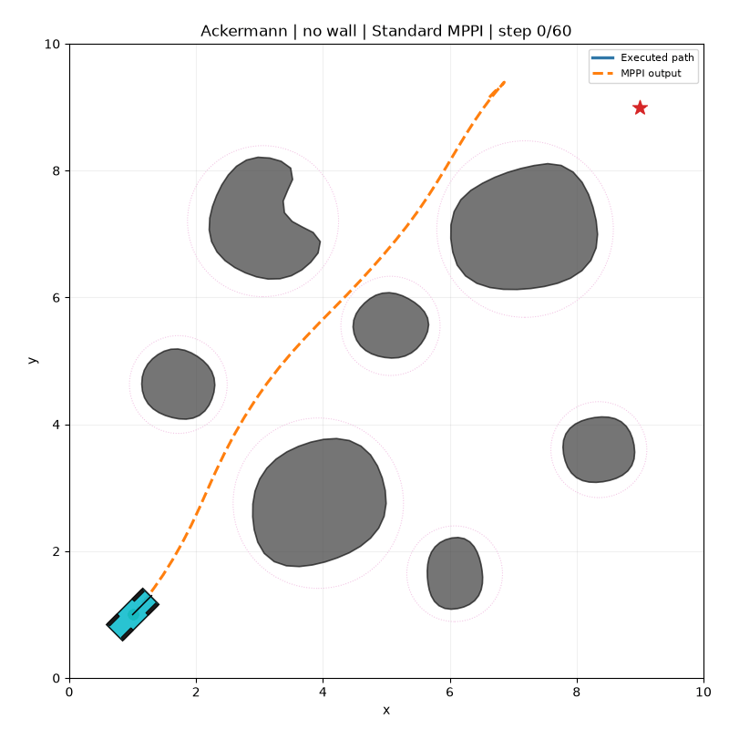 | 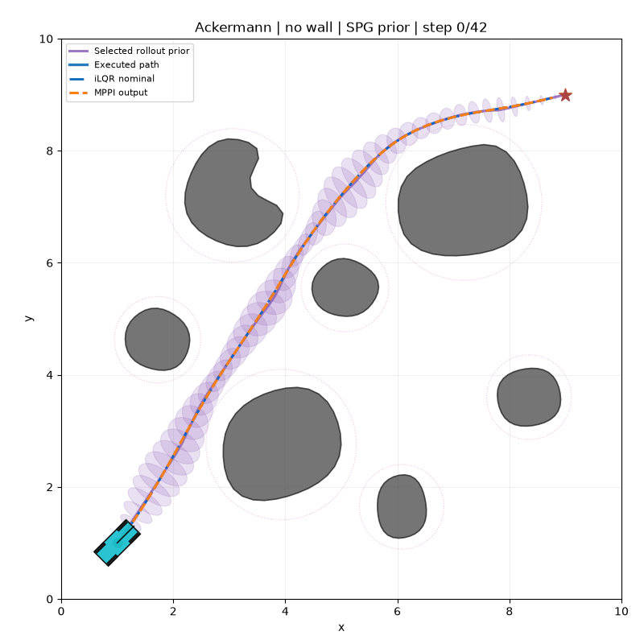 |

#### Static blockage

| Standard MPPI | SPG-prior MPPI |
|:---:|:---:|
| 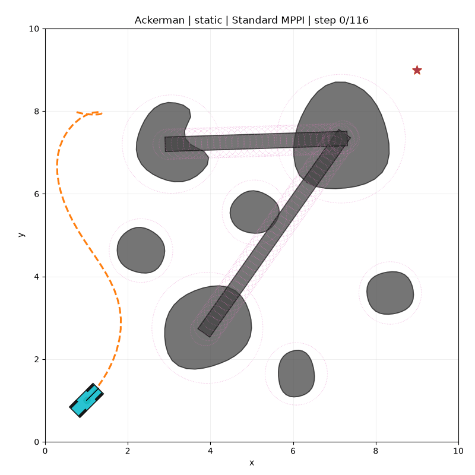 | 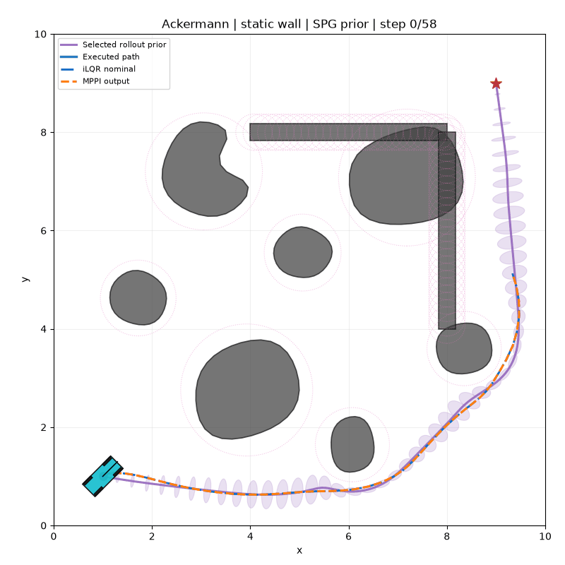 |

#### Dynamic blockage

| Standard MPPI | SPG-prior MPPI |
|:---:|:---:|
| 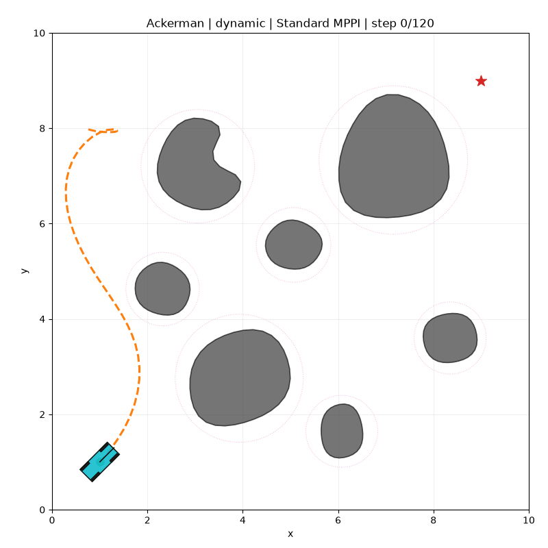 | 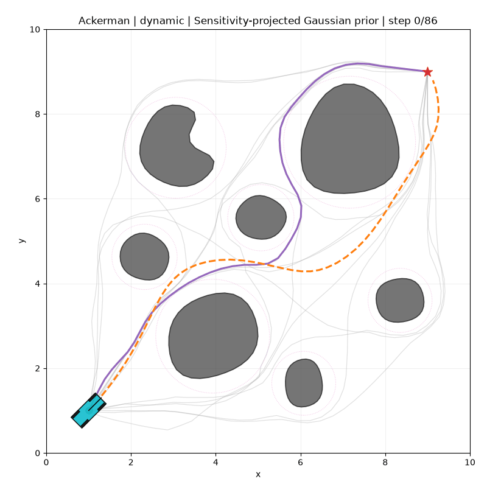 |

### Planar quadrotor

#### No wall

| Standard MPPI | SPG-prior MPPI |
|:---:|:---:|
|  |  |

#### Static blockage

| Standard MPPI | SPG-prior MPPI |
|:---:|:---:|
| 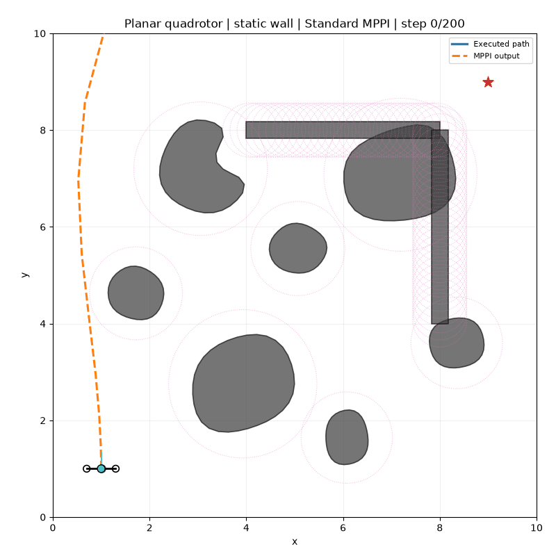 | 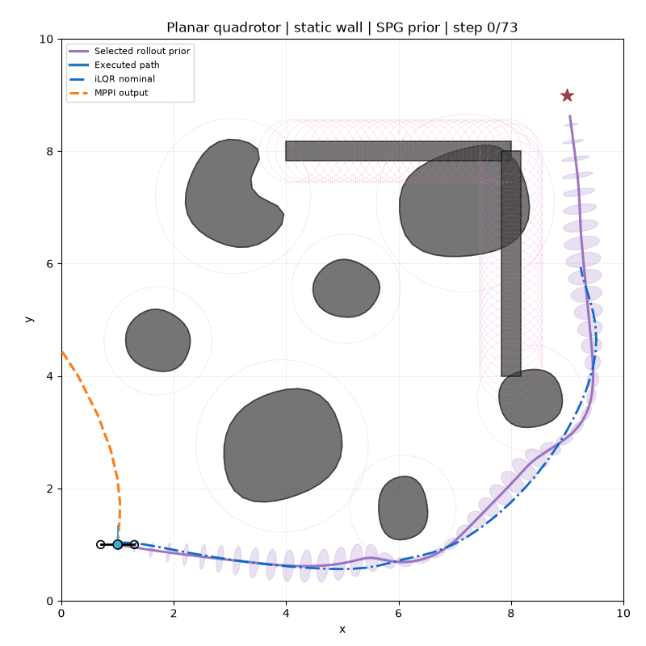 |

#### Dynamic blockage

| Standard MPPI | SPG-prior MPPI |
|:---:|:---:|
| 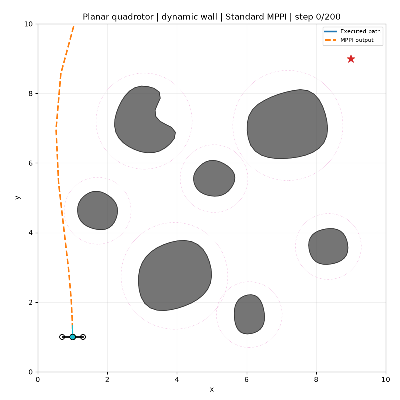 | 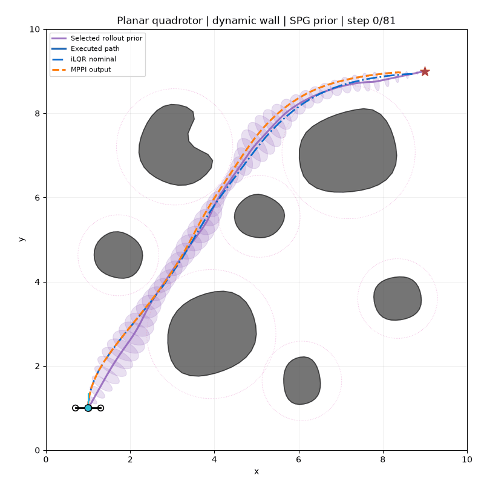 |

### Planar quadrotor with suspended payload

#### No wall

| Standard MPPI | SPG-prior MPPI |
|:---:|:---:|
| 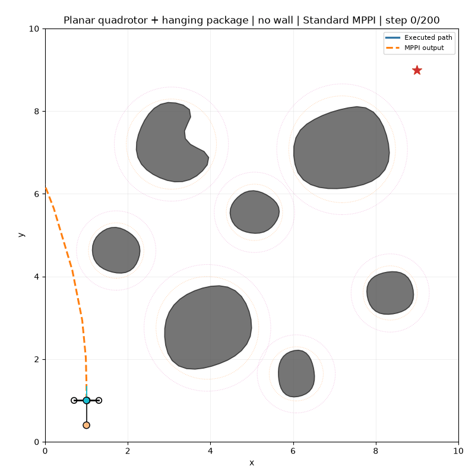 |  |

#### Static blockage

| Standard MPPI | SPG-prior MPPI |
|:---:|:---:|
| 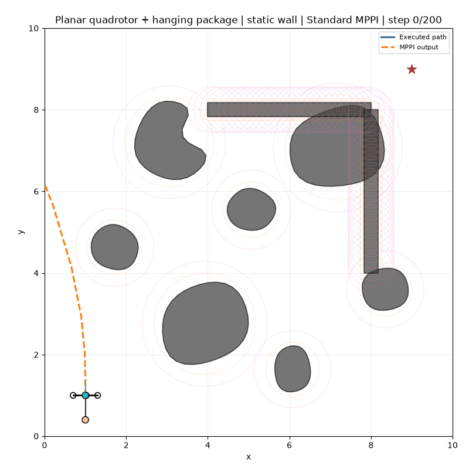 | 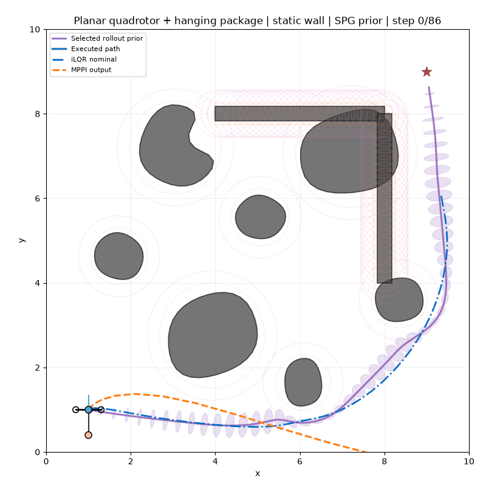 |

#### Dynamic blockage

| Standard MPPI | SPG-prior MPPI |
|:---:|:---:|
| 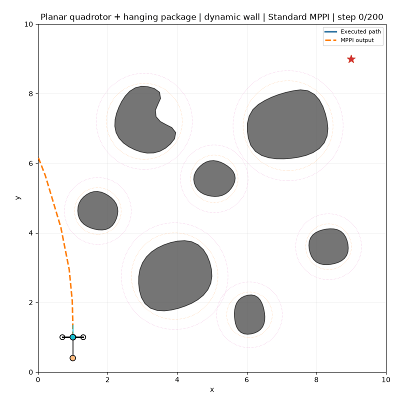 | 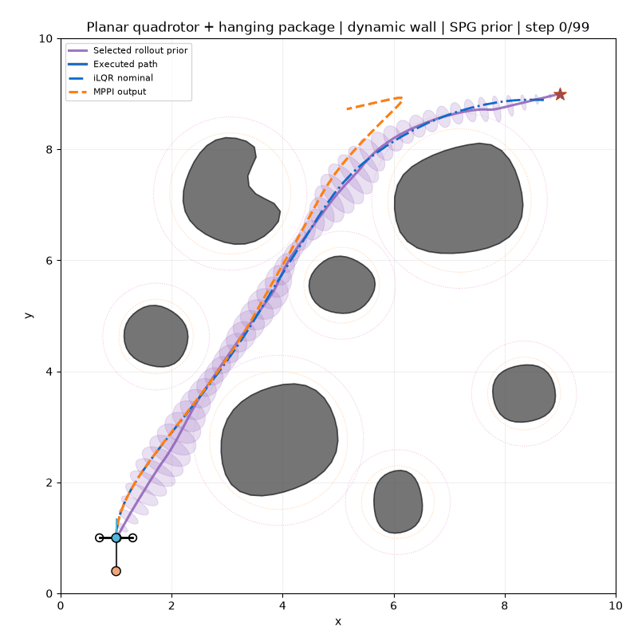 |

Both controllers use the same predictive dynamics and task objective. The comparison isolates the effect of informing the MPPI proposal distribution with the trajectory prior and projecting its spatial covariance into the control space.

# Methods
### Supported systems

The same homotopy-conditioned proposal mechanism is evaluated across two vehicle models with different levels of dynamic complexity.

<table>
  <tr>
    <td width="50%" valign="top">
      <h3>Unicycle</h3>
      <p>
        A compact model used for controlled ablations and rapid experimentation.
      </p>
      <p>
        <strong>State</strong><br>
        Planar position and heading
      </p>
      <p>
        <strong>Control</strong><br>
        Translational velocity and angular velocity
      </p>
      <p>
        The unicycle model isolates the effect of the proposal distribution while keeping the system dynamics simple and interpretable.
      </p>
    </td>
    <td width="50%" valign="top">
      <h3>Ackermann</h3>
      <p>
        A bicycle model used to test whether the same proposal strategy transfers to richer vehicle dynamics.
      </p>
      <p>
        <strong>State</strong><br>
        Planar position, heading, speed, and steering angle
      </p>
      <p>
        <strong>Control</strong><br>
        Acceleration and steering-rate commands
      </p>
      <p>
        This model introduces nonholonomic steering behavior and additional dynamic constraints.
      </p>
    </td>
  </tr>
</table>

> The interactive viewer supports both systems in a single application. The active vehicle model and controller variant can be changed directly from the interface.

---

# Experiments

Each controller is evaluated under three environmental conditions.

| Condition | Prior generation | Execution environment | Purpose |
|:--|:--|:--|:--|
| **No wall** | Original environment | Original environment | Measures nominal navigation performance in the base cluttered scene. |
| **Static blockage** | Additional walls are present | Same blocked environment | Tests planning and control when the obstruction is known in advance. |
| **Dynamic blockage** | Additional walls are absent | Walls are introduced during execution | Tests adaptation when a previously feasible route becomes blocked. |

# Usage
## Repository organization

```text
├── geometry/                 Geometric and collision-checking utilities
├── graph/                    Graph construction and topology components
├── planner/                  Fish-school trajectory generation
├── system/                   Implements the MPPI for the unicycle and ackermann vehicles
├── viewer.py                 Interactive visualization interface
├── requirements.txt          Project dependencies
```

## Getting started

### 1. Create a virtual environment

```bash
python -m venv .venv
```

Activate it according to your operating system.

### 2. Install the dependencies

```bash
python -m pip install --upgrade pip
python -m pip install -r requirements.txt
```

### 3. Launch the interactive viewer

```bash
python viewer.py
```

The viewer provides a unified interface for both supported vehicle models. From the control panel you can:

- Switch between the **Unicycle** and **Ackermann** systems.
- Select any available controller variant.
- Run all experimental scenarios.
- Inspect sampled trajectories, covariance ellipses, obstacle predictions, and control rollouts.

Changing the active system automatically reloads the corresponding simulation module and updates the visualization.

### 4. Reproduce the experiments

To regenerate all experiment results, run the simulation scripts for each vehicle model.

```bash
# Unicycle experiments
python runs_unicycle.py

# Ackermann experiments
python runs_ackerman.py
```

Each script evaluates every controller variant across all experimental conditions and saves the resulting trajectories, controls, covariance estimates, and execution statistics.

---

