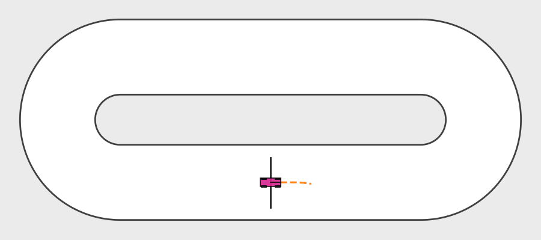
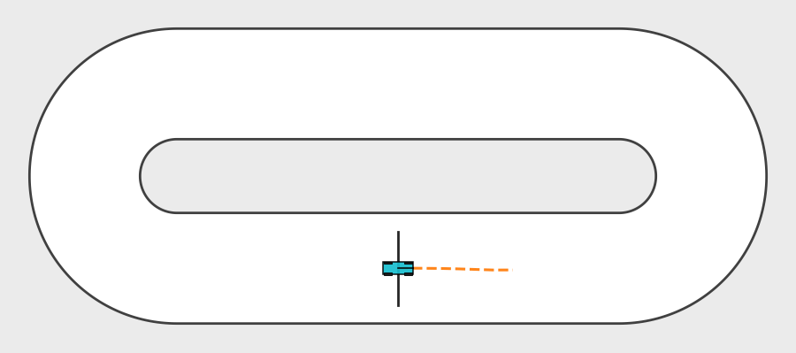
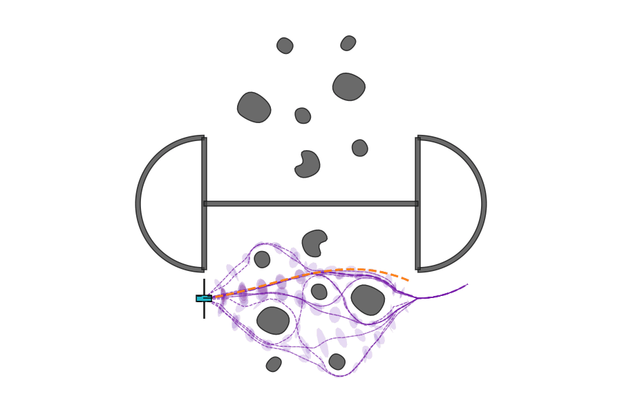
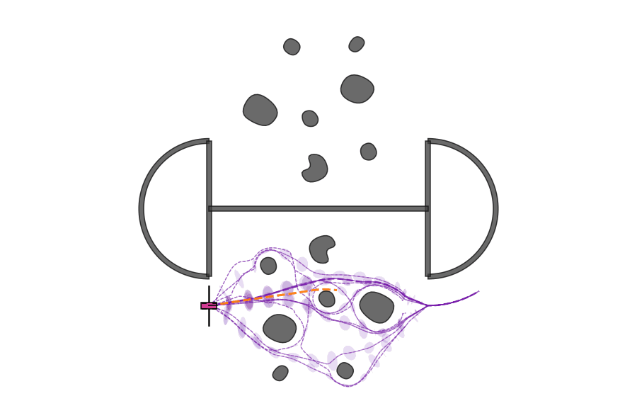

<div align="center">

<h1 style="font-size: 3rem; margin-bottom: 0.25rem;">
  Homotopy-Conditioned MPPI
</h1>

<h2 style="font-size: 1.5rem; font-weight: 400; margin-top: 0;">
  Racing with Dynamic Ackermann and Four-Wheel Vehicle Models
</h2>

<br>

<h3>
  <a href="#overview">Overview</a>
  &nbsp;·&nbsp;
  <a href="#animations">Animations</a>
  &nbsp;·&nbsp;
  <a href="#methods">Methods</a>
  &nbsp;·&nbsp;
  <a href="#experiments">Experiments</a>
  &nbsp;·&nbsp;
  <a href="#usage">Usage</a>
</h3>

</div>

<p align="center">
  
</p>

<p align="center">
  <em>SPG-prior MPPI on the obstacle-free racing track using the four-wheel model with individual wheel dynamics and chassis roll.</em>
</p>

---

## Overview

This project studies trajectory-prior-conditioned Model Predictive Path Integral (MPPI) control in a racing setting with nonlinear ground-vehicle dynamics.

Two vehicle models are supported in the same controller and visualization stack:

- a 7-state dynamic Ackermann model with lateral dynamics, tire-force saturation, aerodynamic drag, rolling resistance, and steering dynamics;
- a 13-state four-wheel model with independent wheel angular velocities, longitudinal and lateral slip, combined tire-force saturation, longitudinal and lateral load transfer, chassis roll, suspension stiffness and damping, and coupled yaw/lateral/roll dynamics.

Both models use the same two control inputs: longitudinal acceleration and steering rate. This keeps the controller interface fixed while increasing the dynamic complexity of the plant.

The project contains two racing environments:

1. `racing_viewer.py` — a clean closed oval used to compare controller behavior without obstacles.
2. `racing_viewer_obstacles.py` — a larger oval with Fish-generated multimodal trajectory priors, fixed obstacles, optional dynamic walls, exact executed-vehicle collision checking, and conservative rollout collision checks.

The central idea is to use geometric trajectory priors to decide where a finite MPPI rollout budget should be placed. The prior guides the proposal distribution; all sampled controls are still propagated through the selected vehicle dynamics and evaluated by the same racing objective.

### Key ideas

<table>
  <tr>
    <td width="50%" valign="top">
      <strong>1. Shared controller interface</strong><br>
      Ackermann and four-wheel vehicles use the same MPPI variants, control inputs, racing objective, and visualization pipeline.
    </td>
    <td width="50%" valign="top">
      <strong>2. Multimodal geometric priors</strong><br>
      The obstacle viewer builds homotopy-conditioned Fish priors on the two straights and joins them into complete racing modes.
    </td>
  </tr>
  <tr>
    <td width="50%" valign="top">
      <strong>3. Dynamics-aware nominal controls</strong><br>
      Geometric prior means are converted into dynamically feasible model-specific nominal trajectories using iLQR-style refinement.
    </td>
    <td width="50%" valign="top">
      <strong>4. Probability-aware sampling</strong><br>
      Active prior probabilities π<sub>h</sub> allocate the rollout budget across feasible homotopy modes.
    </td>
  </tr>
  <tr>
    <td width="50%" valign="top">
      <strong>5. Global MPPI update</strong><br>
      Rollouts from all active modes are pooled and evaluated with one common racing cost before the global exponential MPPI update.
    </td>
    <td width="50%" valign="top">
      <strong>6. Efficient implementation</strong><br>
      Numba kernels, fused rollout-cost evaluation, packed priors, cached collision sectors, and persistent Matplotlib artists reduce runtime overhead.
    </td>
  </tr>
</table>

---

## Animations

The GIF exporter runs only the SPG-prior MPPI variant with the default parameters of both viewers. The exported frames contain only the visualization: no axes, legend, title, GUI controls, or diagnostic text.

### Obstacle-free racing

| Ackermann | Four-wheel |
|:---:|:---:|
|  |  |

### Racing with obstacles

| Ackermann | Four-wheel |
|:---:|:---:|
|  |  |

The four-wheel vehicle uses a distinct magenta body color, while the Ackermann vehicle uses cyan. Both use the same body footprint and track rendering so that differences in behavior come from the dynamics rather than from geometry or visualization scale.

---

## Methods

### Supported vehicle models

<table>
  <tr>
    <td width="50%" valign="top">
      <h3>Dynamic Ackermann</h3>
      <p>
        A 7-state nonlinear bicycle-style model with body-frame longitudinal and lateral velocity, yaw dynamics, steering dynamics, and saturated front/rear tire forces.
      </p>
      <p>
        <strong>State</strong><br>
        x = [p<sub>x</sub>, p<sub>y</sub>, ψ, v<sub>x</sub>, v<sub>y</sub>, r, δ]
      </p>
      <p>
        <strong>Control</strong><br>
        u = [a, δ̇]
      </p>
      <p>
        The model includes friction-limited lateral tire forces, aerodynamic drag, rolling resistance, low-speed slip regularization, and state/input saturation.
      </p>
    </td>
    <td width="50%" valign="top">
      <h3>Four-wheel + chassis dynamics</h3>
      <p>
        A 13-state extension with one rotational state for every wheel and explicit chassis roll dynamics.
      </p>
      <p>
        <strong>State</strong><br>
        x = [p<sub>x</sub>, p<sub>y</sub>, ψ, v<sub>x</sub>, v<sub>y</sub>, r, δ, φ, φ̇, ω<sub>FL</sub>, ω<sub>FR</sub>, ω<sub>RL</sub>, ω<sub>RR</sub>]
      </p>
      <p>
        <strong>Control</strong><br>
        u = [a, δ̇]
      </p>
      <p>
        Each wheel has its own local velocity, slip ratio, slip angle, longitudinal/lateral tire force, normal load, and rotational dynamics. The model adds combined-slip saturation, front/rear torque distribution, longitudinal and lateral load transfer, roll inertia, suspension stiffness and damping, and strong coupling between tire, yaw, lateral, and roll dynamics.
      </p>
    </td>
  </tr>
</table>

The active vehicle is selected from the `Vehicle model` control in either viewer. Ackermann is the default.

### Controller variants

Both viewers expose the same controller family:

| Variant | Description |
|:--|:--|
| **Planner / Centerline iLQR** | Deterministic model-specific nominal trajectory produced from the geometric reference. |
| **Standard MPPI** | Samples around the baseline nominal without using trajectory-prior covariance. |
| **Control bank** | Builds candidate controls from empirical planner paths and evaluates them with the selected vehicle dynamics. |
| **Corridor prior** | Uses the prior mean trajectory as the geometric corridor but retains baseline MPPI control perturbations. |
| **Gaussian prior** | Uses trajectory covariance to shape sampling around the local dynamically feasible nominal. |
| **SPG prior** | Projects spatial trajectory covariance through the local predictive dynamics to obtain dynamics-aware control-space sampling covariance. |

For MPPI variants, sampled control sequences are evaluated together and combined using one exponential weighted update. The deterministic iLQR variant does not perform the MPPI sampling step.

### Multimodal obstacle prior

The obstacle viewer generates Fish trajectories in a canonical scene and maps them rigidly onto the lower and upper racing straights. Homotopy modes from both straights are paired to form complete racing-loop modes. Fixed U-turn segments connect the two Fish-planned straights.

At every control step:

1. modes blocked by the current obstacle configuration are removed;
2. the remaining mode probabilities are renormalized;
3. the total rollout budget is divided according to the active probabilities π<sub>h</sub>;
4. every active mode generates samples using its own Corridor, Gaussian, or SPG proposal;
5. all rollouts are merged into one pool;
6. one common racing objective and one global MPPI weighted update produce the applied control sequence.

The obstacle viewer can display the active prior in purple. Prior mean opacity and line width follow π<sub>h</sub>. Gaussian and SPG variants additionally show a sparse set of partially transparent covariance ellipses. Covariance visualization is suppressed on the fixed U-turns to keep the plot readable.

### Collision handling

The obstacle viewer separates fast predictive collision checking from the final executed-state check:

- MPPI rollouts use conservative circular obstacle covers and swept vehicle checks for speed;
- the accepted executed transition is checked against the exact obstacle polygons;
- when a collision occurs, the terminal frame is refined to the first contact state.

The `hard_collision_clearance` parameter is available from both viewer interfaces.

---

## Experiments

### 1. Obstacle-free oval

`racing_viewer.py` evaluates the controller on a closed racing oval without obstacle interactions. This environment isolates the effect of the vehicle dynamics and proposal distribution.

The default GUI configuration uses:

| Parameter | Default |
|:--|--:|
| Vehicle | Ackermann |
| Controller | SPG prior |
| Laps | 10 |
| Rollouts | 4096 |
| Horizon | 10 |
| Maximum speed | 8.0 m/s |
| Playback speed | 1× |

### 2. Obstacle racing

`racing_viewer_obstacles.py` uses the multimodal Fish prior together with fixed track obstacles and optional dynamic walls.

Three wall modes are available:

| Mode | Behavior |
|:--|:--|
| **No wall** | Uses the fixed obstacle layout only. |
| **Dynamic 1** | Introduces one path-cutting dynamic wall after each completed half-lap; each wall persists for one lap. |
| **Dynamic 2** | Uses the same generation rule, but each dynamic wall persists for two laps, allowing multiple simultaneous active walls. |

The default GUI configuration uses:

| Parameter | Default |
|:--|--:|
| Vehicle | Ackermann |
| Controller | SPG prior |
| Wall mode | No wall |
| Laps | 10 |
| Rollouts | 4096 |
| Horizon | 25 |
| Maximum speed | 6.0 m/s |
| Hard collision clearance | 0.02 m |
| Playback speed | 4× |

---

## Usage

### Repository organization

```text
├── racing_viewer.py             Obstacle-free racing viewer
├── racing_viewer_obstacles.py   Racing viewer with Fish priors, obstacles, and dynamic walls
├── export_spg_gifs.py           Clean SPG GIF exporter for both vehicle models and both viewers
└── system/
    ├── __init__.py
    ├── controller.py            Shared MPPI, prior, Fish-planner, and controller utilities
    ├── ackermann.py             7-state dynamic Ackermann model
    └── four_wheel.py            13-state four-wheel and chassis-roll model
```

The obstacle viewer also expects the Fish-planner project resources to be available from the repository root:

```text
geometry/
graph/
planner/
save/policy.pkl
```

### 1. Create a virtual environment

```bash
python -m venv .venv
```

Activate it for your operating system, then install the Python packages used by the racing code:

```bash
python -m pip install --upgrade pip
python -m pip install numpy numba matplotlib pillow
```

Tkinter is required for the interactive viewers and is commonly provided by the system Python installation. The obstacle viewer additionally requires the dependencies of the Fish planner used by `geometry/`, `graph/`, and `planner/`.

### 2. Run the obstacle-free viewer

```bash
python racing_viewer.py
```

From the control panel you can:

- switch between **Ackermann** and **Four-wheel** dynamics;
- select any controller variant;
- change rollout count, horizon, speed, temporal noise, Σ₀ scale, LBPS parameter, and hard collision clearance;
- show or hide the prior;
- play, pause, and inspect the completed simulation.

### 3. Run the obstacle viewer

```bash
python racing_viewer_obstacles.py
```

This viewer adds:

- multimodal Fish priors;
- active-mode probability visualization;
- fixed obstacles and barriers;
- `No wall`, `Dynamic 1`, and `Dynamic 2` wall modes;
- exact terminal collision visualization.

---

## Notes on comparison

Within a given environment and vehicle model, controller variants share the same predictive dynamics and racing objective. This is intentional: the comparison is designed to isolate the effect of how the finite rollout budget is initialized and distributed in control space.

Switching from Ackermann to the four-wheel model changes the plant, not the controller family. The four-wheel benchmark therefore tests whether the same homotopy-conditioned MPPI machinery remains effective when wheel slip, load transfer, wheel rotational dynamics, chassis roll, and tire-force coupling make the predictive dynamics substantially more nonlinear.